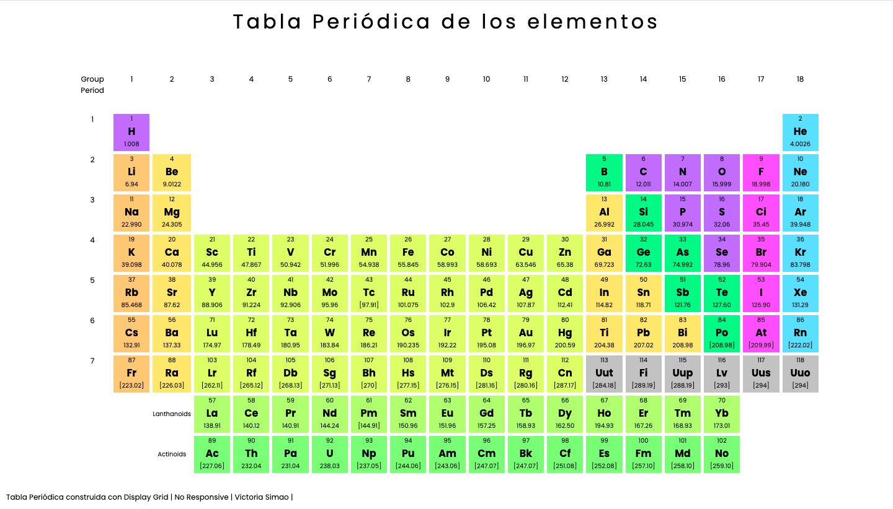

# Periodic table of elements

Periodic table of elements built with CSS grid.
CSS grid allows dividing a page into main areas or regions, by defining the relationship in terms of size, position and layers between parts of a control built from HTML primitives.

# A Complete Guide to Grid

View:

 
[link](http://google.com)

> Victoria Simao

